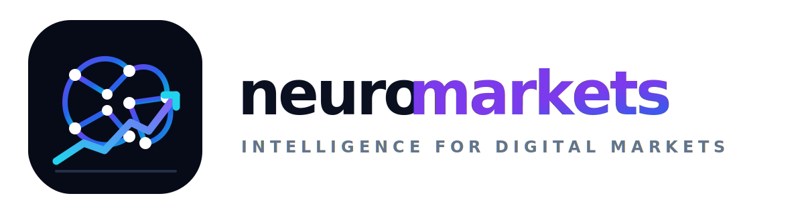

<div align="center">




</div>

---

NeuroMarkets is an **algorithmic trading toolkit for Capital.com**, built around session handling, market data ingestion, technical analysis and bot operations.

This repository is public as a **clean developer-facing release** of the toolkit. It contains automation scripts, research utilities and monitoring components used to operate and evaluate trading workflows.

## What it covers

| Area | Description |
| --- | --- |
| Authentication | Capital.com session handling, account switching and token lifecycle |
| Market data | Data ingestion, transformations and indicator pipelines |
| Strategy | Decision logic, validation and signal evaluation |
| Bots | Automated execution, evaluator workflows and support tooling |
| Monitoring | Local dashboard and operational state inspection |

## Safety first

- No credentials are stored in the repository.
- Broker access must be provided through environment variables.
- Test in `demo` mode before using real funds.
- This project is a toolkit for research and automation workflows, **not financial advice**.

## Project structure

```text
Demos/                Main scripts, bots and trading utilities
dashboard.html        Local dashboard UI
dashboard_server.py   Local server for dashboard/API state views
pyproject.toml        Project metadata and dependencies
requirements.txt      Alternative pip requirements
```

## Core modules

| Module | Purpose |
| --- | --- |
| `Demos/EthConfig.py` | Central configuration and environment validation |
| `Demos/EthSession.py` | Authentication, session lifecycle and account access |
| `Demos/DataEth.py` | Market data collection and technical indicators |
| `Demos/EthStrategy.py` | Strategy and decision rules |
| `Demos/EthBoy.py` | Main automated trading bot |
| `Demos/Evaluador.py` | Position evaluation and positive-close automation |
| `dashboard_server.py` | Local dashboard server for state inspection |

## Environment variables

Create your own local environment and set these values before running the bots.

| Variable | Description |
| --- | --- |
| `CAPITAL_API_KEY` | Capital.com API key |
| `CAPITAL_LOGIN` | Capital.com account email |
| `CAPITAL_PASSWORD` | Capital.com API password |
| `CAPITAL_ACCOUNT_ID` | Target account identifier |
| `CAPITAL_OPERATION_MODE` | `demo` or `real` |
| `DISCORD_WEBHOOK_URL` | Optional webhook for alert notifications |
| `NEUROMARKETS_ALERT_SOUND` | Optional path to a local alert sound file |

Template:

```text
.env.example
```

## Quick start

### 1. Install dependencies with uv

```bash
uv sync
```

Optional GUI extras:

```bash
uv sync --extra gui
```

### 2. Configure environment

Linux/macOS:

```bash
export CAPITAL_API_KEY="your_api_key"
export CAPITAL_LOGIN="you@example.com"
export CAPITAL_PASSWORD="your_api_password"
export CAPITAL_ACCOUNT_ID="your_account_id"
export CAPITAL_OPERATION_MODE="demo"
```

Windows PowerShell:

```powershell
$env:CAPITAL_API_KEY = "your_api_key"
$env:CAPITAL_LOGIN = "you@example.com"
$env:CAPITAL_PASSWORD = "your_api_password"
$env:CAPITAL_ACCOUNT_ID = "your_account_id"
$env:CAPITAL_OPERATION_MODE = "demo"
```

### 3. Validate setup

```bash
uv run python Demos/EthConfig.py
```

### 4. Run a bot or tool

```bash
uv run python Demos/EthBoy.py
uv run python Demos/Evaluador.py
uv run python dashboard_server.py
```

## Dashboard

The dashboard server exposes local bot state and opens a local UI at:

```text
http://localhost:8765
```

It is intended for local monitoring and diagnostics.

## Publication notes

This public version excludes internal instructions, local machine notes, embedded webhook secrets and binary alert assets that do not belong in an open repository.

If you clone this project for your own environment, you must supply your own credentials, account IDs and notification endpoints.

## License

See `LICENSE`.
